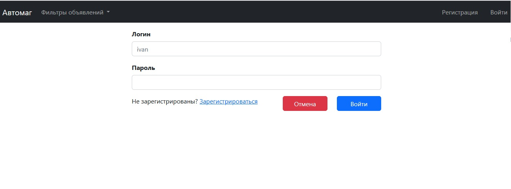
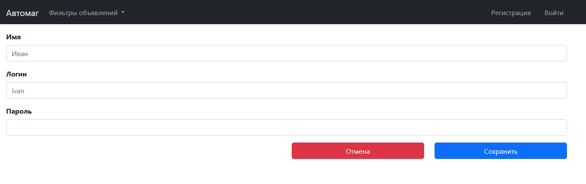
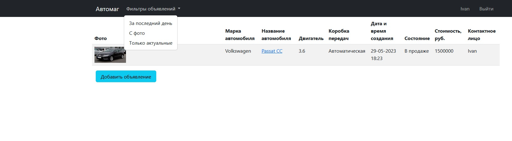
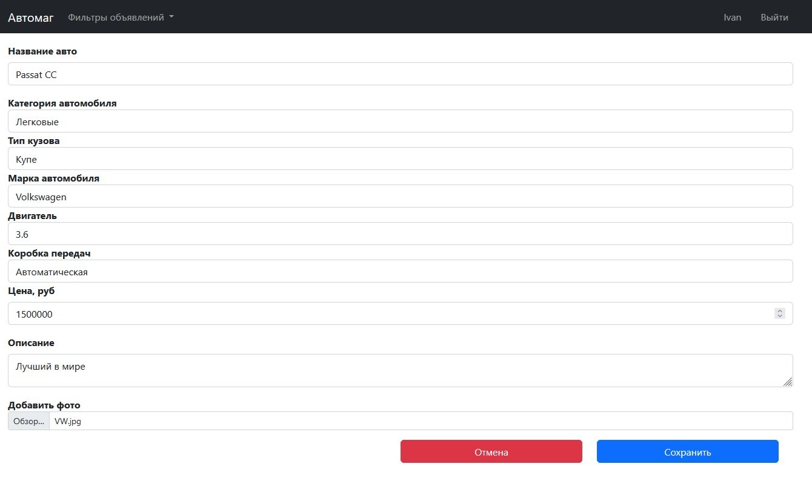
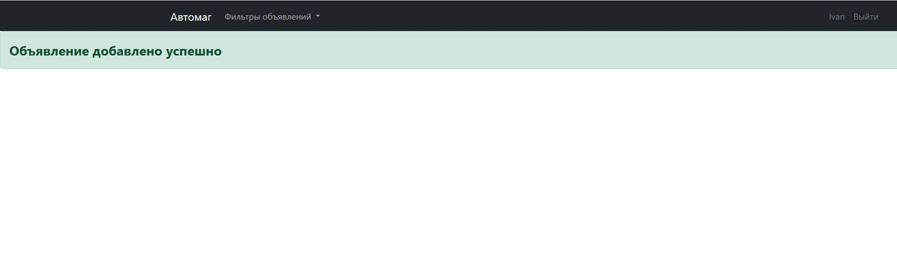
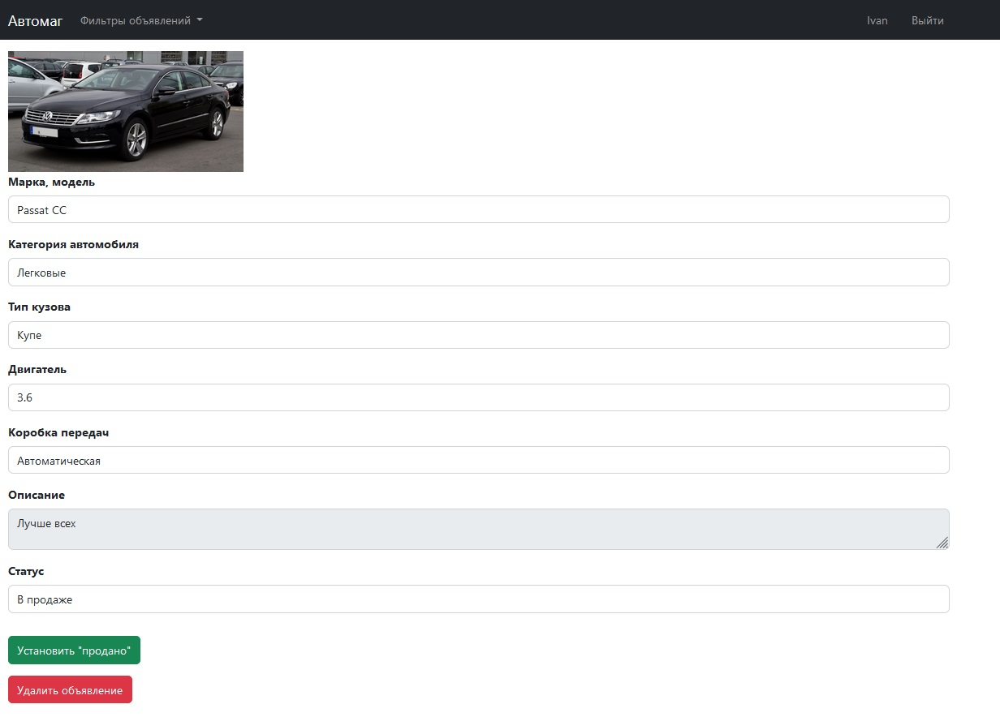
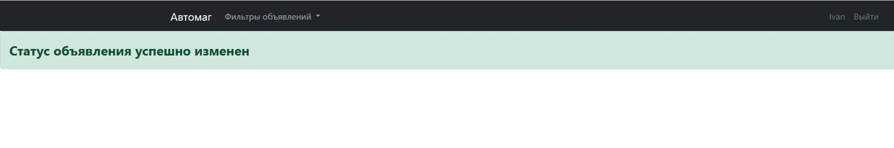
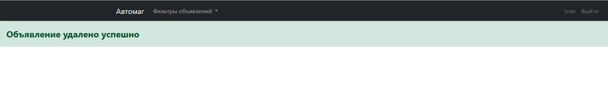

# проект "АвтоМаг"

## О проекте 

Прикладное приложение для продажи автомобилей.
Представляет из себя набор таблиц в которых можно посмотреть объявления, отсортированные разными способами.
В приложение имеется возможность добавления, удаления объявлений и изменения статуса объявления.

## Стек технологий:

    Spring boot 2.7.6
    Thymeleaf 3.0.15
    Bootstrap 4.3.1
    Hibernate 5.6.11.Final
    PostgreSql 42.5.1
    Liquibase 4.15
    Lombok 1.18.22
    Java 17

## Требования к окружению:

    Java 17
    Maven 3.8
    PostgreSql 14

## Запуск проекта:

- скачать проект
- создать базу данных: ```create database cars;```
- запусть Main class, расположение: ru.job4j.cars
- Открыть в браузере [ссылку](http://localhost:8080/)

## Взаимодействие с приложением:

#### Взаимодействие с приложением начинается со страницы входа.


#### Для того чтобы зарегистриваться необходимо нажать на соответсвующую кнопку, что приведет нас к странице регистрации.


#### На главной странице находятся все объявления, кнопка с фильтрами, кнопка добавить объявление.

- кнопка "Добавить объявление" переводит на страницу создания нового объявления.
  

#### После добавления объявления выводится страница с информационным сообщением.


#### При нажании на название автомобиля происходит переход на страницу объявления.

- кнопка "Установить продано" меняет статус объявления и выводит страницу с информационным сообщением.
  
- кнопка "Удалить объявление" удаляет объявления и выводит страницу с информационным сообщением.
  

## Telegram для связи с разработчиком:

@Stanislav_Bogatyrev
[ссылка](https://t.me/Stanislav_Bogatyrev)